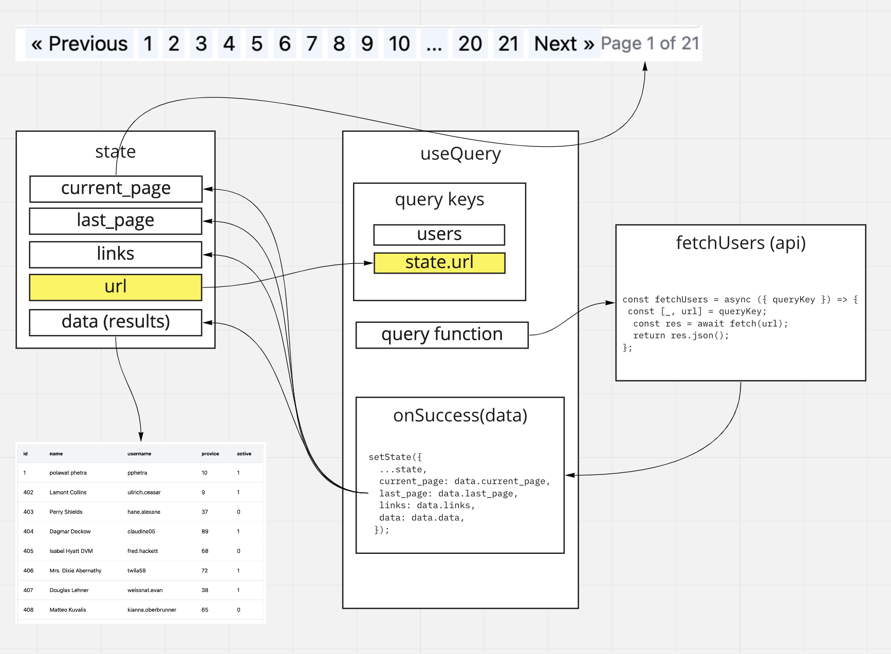
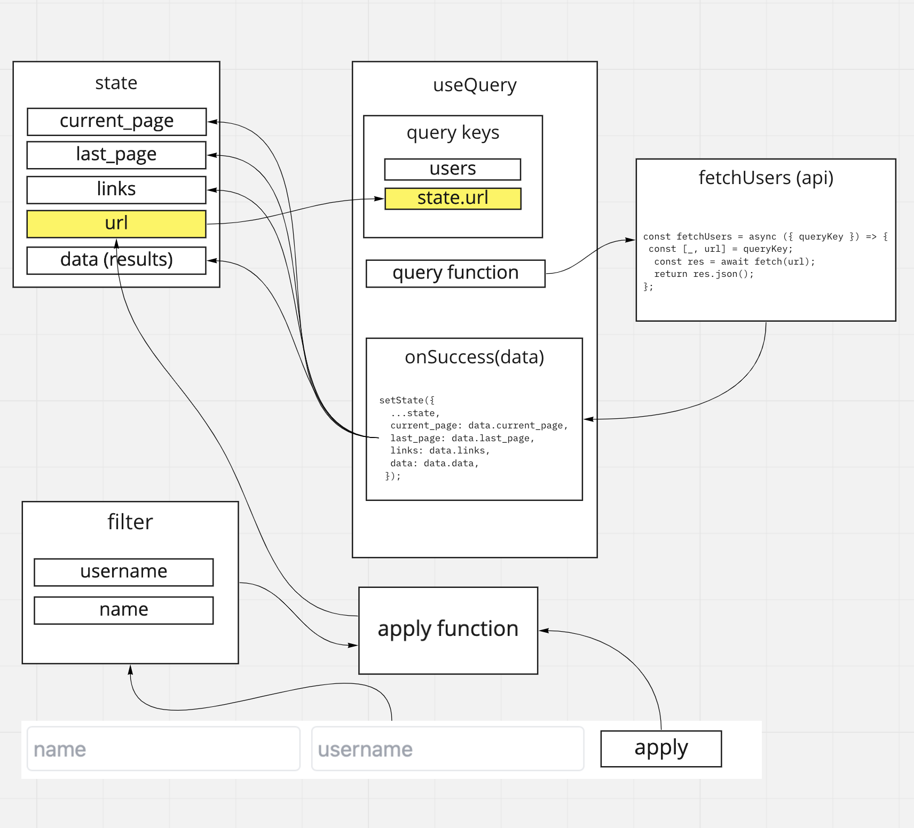
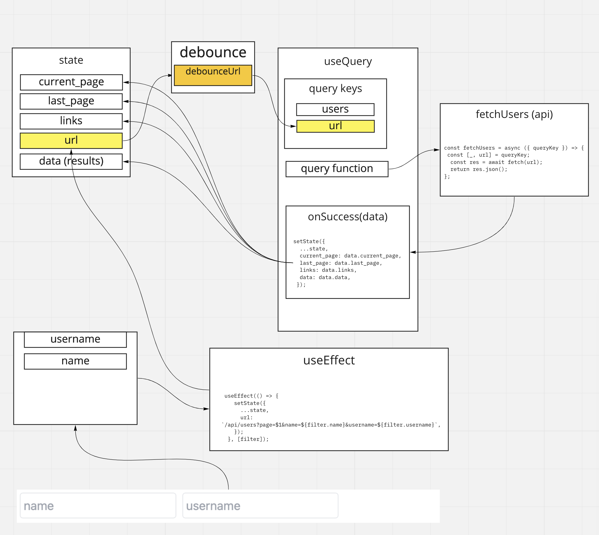

## หน้าจอ Users Listing

ติดตั้ง @tanstack/react-query

`yarn add @tanstack/react-query`

Config Provider ที่ \_app.js

```js
import { QueryClientProvider, QueryClient } from "@tanstack/react-query";

import "../styles/globals.css";

const queryClient = new QueryClient();

function MyApp({ Component, pageProps }) {
  return (
    <QueryClientProvider client={queryClient}>
      <Component {...pageProps} />
    </QueryClientProvider>
  );
}

export default MyApp;
```

config next.config.js เพิ่ม proxy ไปยัง server เพื่อหลบปัญหาเรื่อง CORS

note: ตอน deploy งานจริง เราจะใช้ nginx ทำ proxy ด้านหน้า ก็จะไม่มีปัญหาเรื่อง CORS

```js
  async rewrites() {
    return [
      {
        source: "/api/:path*",
        destination: "http://localhost:8000/api/:path*",
      },
    ];
  },
```

สร้าง file /pages/users/index.js

```js
import { useQuery } from "@tanstack/react-query";

export default function UserList() {
  const query = useQuery(["users"], () =>
    fetch("/api/allusers").then((res) => res.json())
  );

  return (
    <div>
      <h2>users</h2>
      {query.isLoading ? (
        <div>loading...</div>
      ) : (
        <ul>
          {query.data.map((user) => (
            <li key={user.id}>{user.name}</li>
          ))}
        </ul>
      )}
    </div>
  );
}
```

string "users" ที่ pass ให้กับ function userQuery ใน statement `useQuery(["users"], ...)` มีชื่อเรียกว่า Query Keys
Query Key จะใช้ในการ control การ refetch, การ clear cache, ...

ค่าที่ return จาก useQuery

- query.isLoading
- query.data
- query.error

ดูข้อมูลเพิ่มเติม [Link]()

---

## แสดงผลด้วย table

```js
import { useQuery } from "@tanstack/react-query";

export default function UserList() {
  const query = useQuery(["users"], () =>
    fetch("/api/allusers").then((res) => res.json())
  );

  return (
    <div className="max-w-4xl p-2">
      <h2>users</h2>
      {query.isLoading ? (
        <div>loading...</div>
      ) : (
        <table className="bg-white w-full border rounded shadow-sm">
          <thead>
            <tr className="border-b bg-gray-100 text-sm font-medium text-left h-12">
              <th className="p-4">id</th>
              <th className="p-4">name</th>
              <th className="p-4">username</th>
              <th className="p-4">provice</th>
              <th className="p-4">active</th>
            </tr>
          </thead>
          <tbody>
            {query.data.map((user) => (
              <tr key={user.id} className="border-b h-10">
                <td className="p-4">{user.id}</td>
                <td className="p-4">{user.name}</td>
                <td className="p-4">{user.username}</td>
                <td className="p-4">{user.province_code}</td>
                <td className="p-4">{user.is_active}</td>
              </tr>
            ))}
          </tbody>
        </table>
      )}
    </div>
  );
}
```

---

## Paginate

เพิ่ม state เพื่อเก็บ current_page, last_page, link, url, data

```js
const [state, setState] = useState({
  current_page: 1,
  last_page: 1,
  links: [],
  url: "/api/users?page=1",
  data: [],
});
```

สร้าง function เพื่อใช้ในการ fetch โดย function นี้จะถูกเรียกใช้จาก useQuery

```js
const fetchUsers = async ({ queryKey }) => {
  const [_, url] = queryKey;
  const res = await fetch(url);
  return res.json();
};
```

แก้ไขการเรียก useQuery ให้มี query keys ขึ้นอยู่กับ url

```js
const query = useQuery(["users", state.url], fetchUsers, {
  keepPreviousData: true,
  onSuccess: (data) => {
    console.log("data", data);
    setState({
      ...state,
      current_page: data.current_page,
      last_page: data.last_page,
      links: data.links,
      data: data.data,
    });
  },
});
```

render paginate จาก state.links

```js
<div>
  <div className="flex justify-between items-center">
    <div className="flex items-center"></div>
    <div className="flex items-center">
      <span className="flex flex-row gap-1">
        {state.links.map((link) => (
          <a
            className="px-1 bg-blue-50"
            key={link.label}
            href="#"
            onClick={(e) => {
              e.preventDefault();
              setState({ ...state, url: link.url });
            }}
          >
            {decode(link.label)}
          </a>
        ))}
      </span>
      <span className="text-sm text-gray-500">
        Page {state.current_page} of {state.last_page}
      </span>
    </div>
  </div>
  <pre>{JSON.stringify(state, null, 2)}</pre>
</div>
```

ข้อมูลที่ return กลับมาจาก laravel มีการ encode HTML entity ด้วย
สร้าง function เพื่อ decode ค่า

```
npm install --save html-entities

import {decode} from 'html-entities';
```



---

## Filter

สร้าง state สำหรับเก็บ filter

```js
const [filter, setFilter] = useState({
  name: "",
  username: "",
});
```

render `<input>` field สำหรับ name และ email

```js
<div className="flex gap-2 my-2">
  <input
    className="border rounded p-1"
    type="text"
    value={filter.name}
    placeholder="name"
    onChange={(e) => setFilter({ ...filter, name: e.target.value })}
  />
  <input
    className="border rounded p-1"
    type="text"
    value={filter.username}
    placeholder="username"
    onChange={(e) => setFilter({ ...filter, username: e.target.value })}
  />
</div>
```

ทำปุ่ม apply filter

```js
<button
  className="px-4 py-1  rounded bg-blue-500 text-white"
  onClick={() => {
    setState({
      ...state,
      url: `/api/users?page=1&name=${filter.name}&username=${filter.username}`,
    });
  }}
>
  filter
</button>
```



---

## Live search

ใช้ [useDebounce](https://usehooks.com/useDebounce/)
สร้าง file /components/hook/useDebounce.js

```js
// Hook
export function useDebounce(value, delay) {
  // State and setters for debounced value
  const [debouncedValue, setDebouncedValue] = useState(value);
  useEffect(
    () => {
      // Update debounced value after delay
      const handler = setTimeout(() => {
        setDebouncedValue(value);
      }, delay);
      // Cancel the timeout if value changes (also on delay change or unmount)
      // This is how we prevent debounced value from updating if value is changed ...
      // .. within the delay period. Timeout gets cleared and restarted.
      return () => {
        clearTimeout(handler);
      };
    },
    [value, delay] // Only re-call effect if value or delay changes
  );
  return debouncedValue;
}
```

ลบปุ่ม filter ทิ้งไป

ใช้ debounce เข้ามาจำค่า state.url และส่งค่านั้นให้ useQuery แทน

```js
const debouncedUrl = useDebounce(state.url, 500);

const query = useQuery(["users", debouncedUrl], fetchUsers, {
  keepPreviousData: false,
  onSuccess: (data) => {
    console.log("data", data);
    setState({
      ...state,
      current_page: data.current_page,
      last_page: data.last_page,
      links: data.links,
      data: data.data,
    });
  },
});
```

เพิ่ม useEffect ที่ ทุกครั้งที่ค่า filter เปลี่ยนให้เปลี่ยนค่า url ใน state

```js
useEffect(() => {
  setState({
    ...state,
    url: `/api/users?page=1&name=${filter.name}&username=${filter.username}`,
  });
}, [filter]);
```


